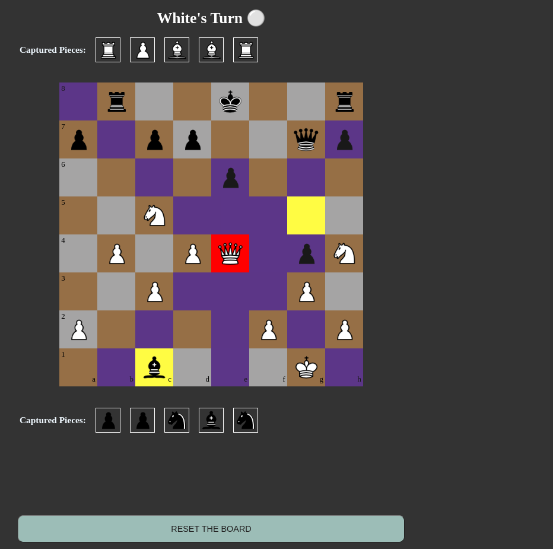

# ChessGame

ChessGame is an interactive chess application built using Python, Django, and JavaScript. It features a basic AI engine for a challenging gameplay experience. This project aims to provide a platform for chess enthusiasts to practice and improve their skills.

## Features

- **AI Opponent**: Play against a computer-controlled opponent.
- **Interactive UI**: A user-friendly interface built with JavaScript.
- **Two-Player Mode**: Support for local two-player gameplay, allowing you to challenge a friend.
- **Advanced Chess Rules**: Implements en passant, draw, and stalemate conditions, enhancing the game's realism and strategic depth.

## Technical Overview 
The backend, built with Django, processes chess game logic, including move validation and game state updates, leveraging Django models for game state representation. JavaScript on the frontend makes AJAX calls to the Django backend, enabling live updates of the game board and player interactions without full page reloads, providing a smooth and interactive user experience. This setup ensures efficient data handling and real-time responsiveness in the web-based chess application.

## Installation

Ensure you have Python3 and Django installed (`pip install Django`). Clone the repository and run the following command:

```bash
python3 manage.py runserver
```

## Screenshots 



